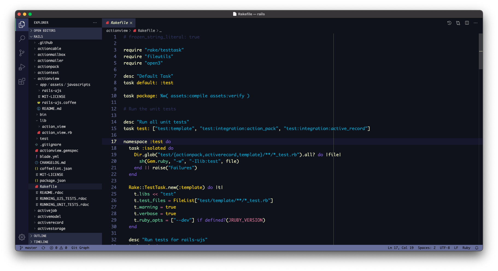

# spaceduck-vscode

This an unofficial port of 

> https://github.com/pineapplegiant/spaceduck

---

## Installation

Simply copy this repository to your vscode/vscodium installation paths `extension` folder. See below for examples. Then simply select the theme from the color theme menu.

### MacOS / Linux

#### VsCodium

```console
~/.vscode-oss/extensions/spaceduck-vscode
```
#### VsCode

```console
~/.vscode/extensions/spaceduck-vscode
```

## Colors are wrong

This repository aims to maintain a color pallet as close to `https://github.com/pineapplegiant/spaceduck` as possible within vscode/vscodium. If you see areas for improvement, please feel free to submit a pull request.

## TODO
- [ ] Update syntax for Terminal
- [ ] Get approval from spaceduck creator to add theme to `vs code marketplace` & `open vsx registry`

## Screenshot

