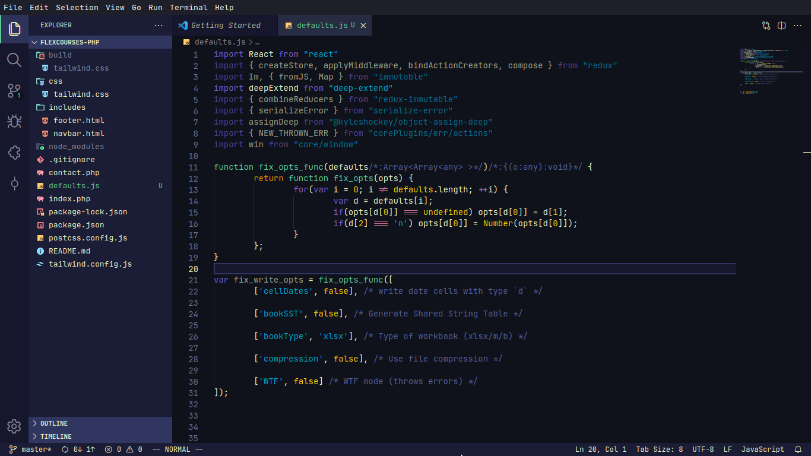

# Spaceduck theme for [vscode](https://code.visualstudio.com/) 🚀 🦆

> A [spaceduck](https://github.com/spaceduck-theme/spaceduck) theme for [vscode](https://code.visualstudio.com/)


## Install

1. Open vscode
2. Open the extensions tab
3. Search for spaceduck and install the extension
4. Blast off to Proxima Centauri b with these silky galaxy colors

## Sample images



## Tips and Recommendations
- the theme has italics support, but you need a font that also has an italics variation. I recommend Jetbrains Mono (Free), Operator Mono (Paid, 200$) but most themes support those as well.
- I am thinking of making a Icon theme that matches spaceduck, but for now I have found that **material-theme-icons-palenight** works best.
- here is a set of font related settings I would recommend
```json
{
    "editor.fontSize": 17,
    "editor.lineHeight": 25,
    "editor.letterSpacing": 0.5,
    "files.trimTrailingWhitespace": true,
}
```


## Team

This project is currently maintained by the following awesome person(s)

| [](https://github.com/YoussefBouzekri) | [](https://github.com/pineapplegiant)
|---|---|
| [YoussefBouzekri](https://github.com/YoussefBouzekri) | [pineapplegiant](https://github.com/pineapplegiant)

.. and is contributed to by these [awesome people](https://github.com/spaceduck-theme/vscode/graphs/contributors)
